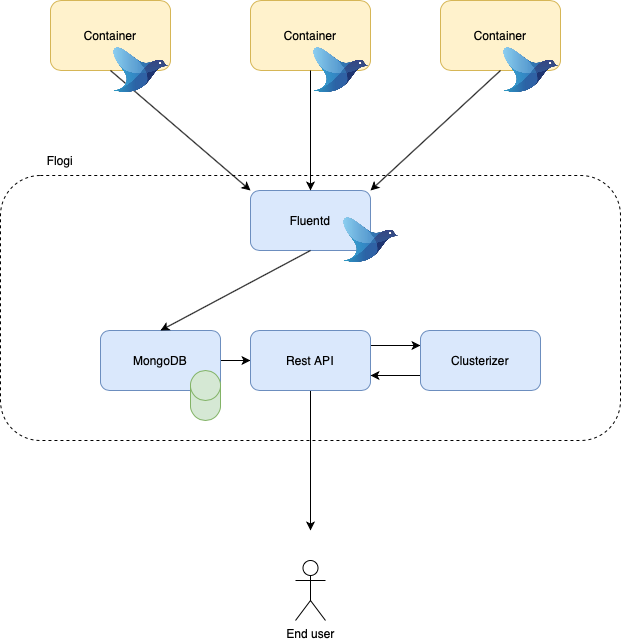

# Flogi
Flogi (Fluentd + logs + Intelligence) in an application to monitor Containers logs with a little bit of intelligence.

## Architecture

## Built with

* Fluentd
* MongoDB
* node.js
* Docker
* sklearn

## Team

1. João Lira: <jpls@cin.ufpe.br>
2. José Reginaldo: <jrbj@cin.ufpe.br>
3. Leão Liu: <llm2@cin.ufpe.br>