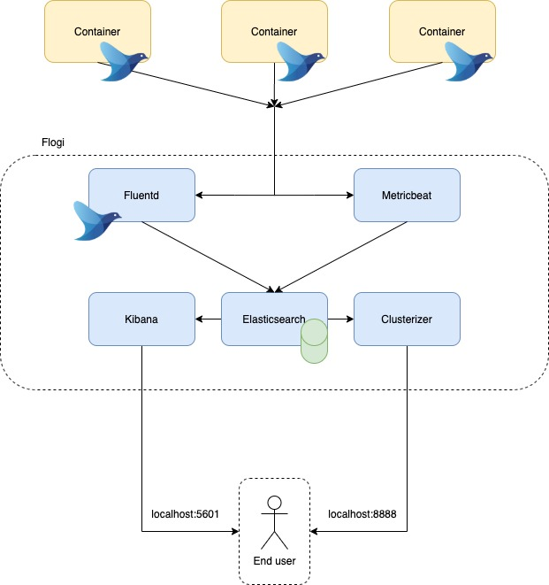

# Flogi
Flogi (Fluentd + logs + Intelligence) in an application to monitor Containers logs and take metrics with a little bit of intelligence (but not yet).

Flogi is built with the EFK stack (Elasticsearch + Fluentd + Kibana) with a metricbeat integration.

We also provide a jupyter-notebook that connects to elasticsearch and applies LDA (Latent Dirichlet allocation) to some of the logs to detect words that are related to each other by topics.

[Link](https://docs.google.com/presentation/d/10f2hk9IX_MxVG62aGdwb-C48a5WSrvOGnnq8ktbN3xI/edit?usp=sharing) to the project model canvas.

## Architecture



## Dependencies

* docker engine version 19.03 or higher
* docker-compose version 1.27 or higher

## Running the Project

0. Make sure your Docker have enough memory. We recommend at least 4GB. (we set this up for you at the script we provided, but only for linux)

1. Clone the repo:

```
git clone https://github.com/lionliu/Flogi.git
```

2. Setup fluentd as the logging driver at your docker compose file:

    * Put these lines into the container you wish to monitor:
    ```
    logging:
        driver: fluentd
        options:
            &nbsp;fluentd-address: localhost:24224
              tag: docker.{{.ID}} # container-id by default
    ```

    * Example:
    ```
    version: "3"

    services:
        front-end:
            image: image
            restart: always
            read_only: true
            logging:
                driver: fluentd
                options:
                    fluentd-address: localhost:24224
                    tag: docker.{{.ID}} # container-id by default
    ```

3. Execute the script

```
bash start.sh
```

4. Access Kibana at <localhost:5601>

5. To access the metrics:
    *  Click the hambuguer button
    *  Select metrics at the Observability section
    *  At first it will show only the metricbeat container. To view all the containers, click at the Show menu and select Docker Containers. 

6. To access logs:
    *  Click the hambuguer button
    *  Select discover

## Accessing the clusterizer

1. After running the steps above, get the clusterizer address with the following command:
```
docker logs clusterizer
```

## Stopping the Project

1. Run: `docker-compose down `

## Built with

* Fluentd
* Elasticsearch
* Kibana
* Metricbeat
* Docker
* jupyter notebook

## Team

1. João Lira: <jpls@cin.ufpe.br>
2. José Reginaldo: <jrbj@cin.ufpe.br>
3. Leão Liu: <llm2@cin.ufpe.br>